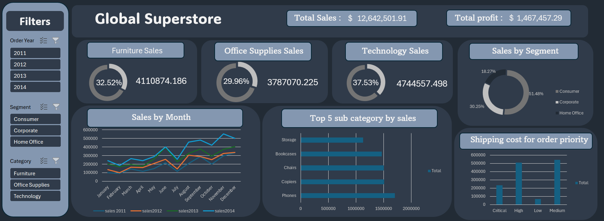
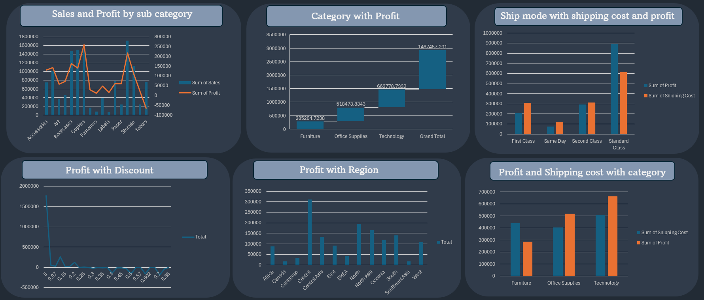

# Global Superstore Excel Dashboard

This project showcases **interactive Excel dashboards** built using the **Global Superstore dataset**, providing valuable business insights about **sales, profit, shipping costs, and discounts** across various categories, segments, and regions.

---

## Project Overview

The purpose of this project is to analyze the Global Superstore dataset and visualize key business metrics using **Excel dashboards**.  
It includes interactive filters and charts to explore:

- Total sales and profit over time
- Sales by product category and sub-category
- Profit analysis by region, discount, and shipping mode
- Comparison between shipping cost and profit
- Dynamic filters for year, segment, and category

---

## Dashboard 1: Global Sales Overview

**Highlights:**

- Sales and profit percentage by product category
- Year, Segment, and Category slicers for interactive filtering
- Sales trends over months
- Top 5 sub-categories by sales
- Shipping cost by order priority

---

## Dashboard 2: Profit Analysis

**Highlights:**

- Sales and profit comparison by sub-category
- Profit by discount, region, and shipping mode
- Relationship between profit and shipping cost
- Category-wise profit visualization

---

## Key Excel Features Used

- Pivot Tables
- Pivot Charts
- Slicers for interactivity
- Combination charts (Line + Column)
- Data cleaning & formatting
- Custom dashboard design and color theme

---

## Tools & Skills

- **Microsoft Excel**
- **Data Visualization**
- **Data Analysis**
- **Dashboard Design**
- **Business Insights Reporting**

---

## 🧠 Insights Gained

- **Technology** category generated the highest profit.
- **Furniture** had lower profit margin due to higher shipping costs.
- **Standard Class** shipping mode is most frequently used but has higher costs.
- Profit decreases significantly with higher **discount rates**.
